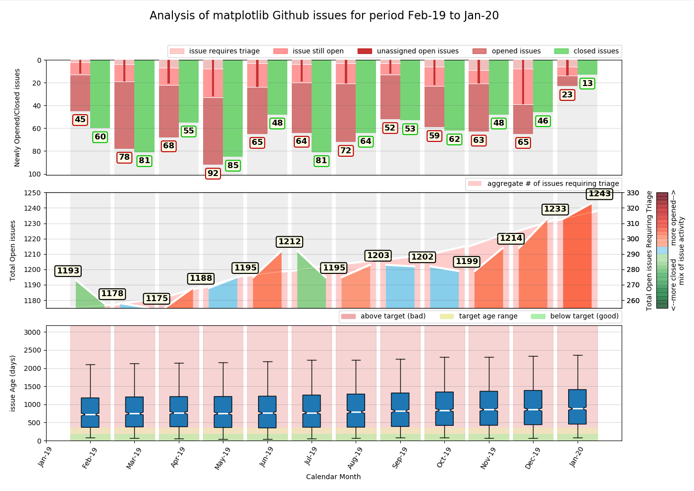

<h1>Welcome to RepoDash</h1>

Do you maintain a project codebase on Github? Would you like to be able to collate statistics 
that summarise historic monthly activity on that codebase and see, at a glance, how that impacts 
the project issues list over time? Would you like to be able to perform this analysis for any 
given time period of your choosing?

RepoDash can do this for any project on Github. It uses the Github API to collect repository 
data and generate a data visualisation of a range of historic monthly metrics of the project 
issues list over a user-specified period of time, including:

<ul>
<li>How many new issues were created?</li>
<li>How many existing issues were resolved?</li>
<li>For all issue activity in a month, what was the percentage split between opened / closed?</li>
<li>What was the rate of growth/reduction of the issues list?</li>
<li>How long, on average have open issues been in the isssues list?</li>
<li>What was the spread of issue ages in the issues list?</li>
</ul>

 

Perhaps you are managing an open source project, the maintenance of which you'd like to keep on top 
of. Or perhaps you manage a software project at work where you are required to provide your boss with 
exective summary updates of your support team's progress on an ongoing monthly basis. Either way, if 
your codebase is managed via Github, RepoDash could be just what you need.

For demo purposes, this code displays the most recent 12 months of matplotlib1 metrics 
by default. To analyse your own project repository, simply provide your github user name and repository 
name on the command line. It couldn't be simpler.

The current version of RepoDash has only been tested with open source (public) projects. However, there
are plans to make sure it works with private ones as well... watch this space!

1 *matplotlib is a popular open science plotting library for python which is utilised by RepDash to 
generate its data visualisations*