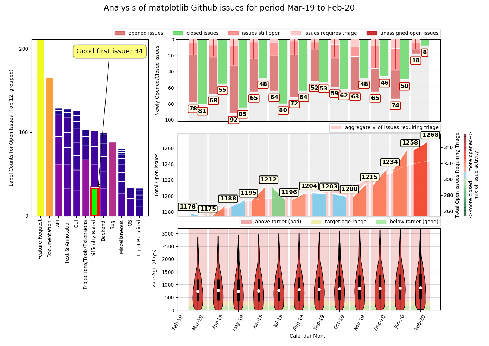

<h1>Welcome to RepoDash</h1>

Do you maintain a project codebase on Github? Would you like to be able to collate statistics 
that summarise historic monthly activity on that codebase and see, at a glance, how that impacts 
the project issues list over time? Would you like to be able to perform this analysis for any 
given time period of your choosing?

RepoDash can do just this. It uses the Github API to collect repository data and generate a 
data visualisation of a range of historic metrics of the project issues list over a user-specified 
period of time. For each calendar month in the time period of interest, it displays the following 
metrics:

<ul>
<li>The number of new issues created</li>
<li>How many of these issues are still open at the time of generating the dashboard</li>
<li>How many of these issues still require triage (labelling) at the time of generating the dashboard</li>
<li>The number of existing issues resolved</li>
<li>The percentage split between opened / closed issues</li>
<li>The aggregate number of open issues in the issues list (month start & month end)</li>
<li>The aggregate number of open issues in the issues list requiring triage (month start & month end)</li>
<li>The change in total number of open issues over the month</li>
<li>The average age and age spread of open issues in the isssues list</li>
</ul>

 

<h3>Typical Use Cases</h3>

Perhaps you are managing an open source project, the maintenance of which you'd like to keep on top 
of. Or perhaps you manage a software product at work where you are required to provide your boss with 
exective summary updates of your support team's progress on an ongoing monthly basis. Either way, if 
your codebase is managed via Github, RepoDash could be just what you need.

<h3>Demo Mode</h3>

For demo purposes, this code processes the first 10 pages of the matplotlib1 project and 
displays the most recent 12 months of metrics by default. Command line arguments allow you to set your
own project repository and analysis timeframe. It couldn't be simpler.

1 *<a href="https://matplotlib.org/"><strong>matplotlib</strong></a> is a popular open science 
plotting library for python which is utilised by RepoDash to generate its data visualisations*

<h3>Future Development</h3>

This project is a work in progress. The current version of RepoDash has only been tested with open 
source (public) projects. However, there are plans to ensure that it works with private ones as well. 
Over time, we also plan to build on the range of metrics offered and make it easy for the user to select 
which metrics to display... watch this space!

