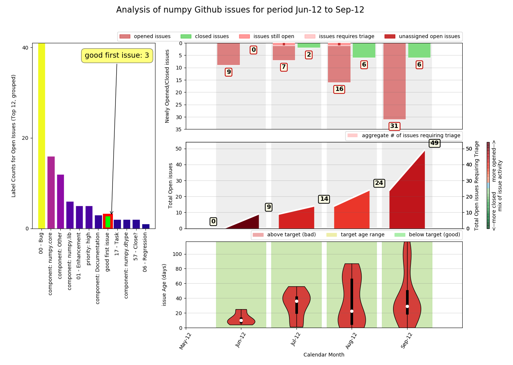
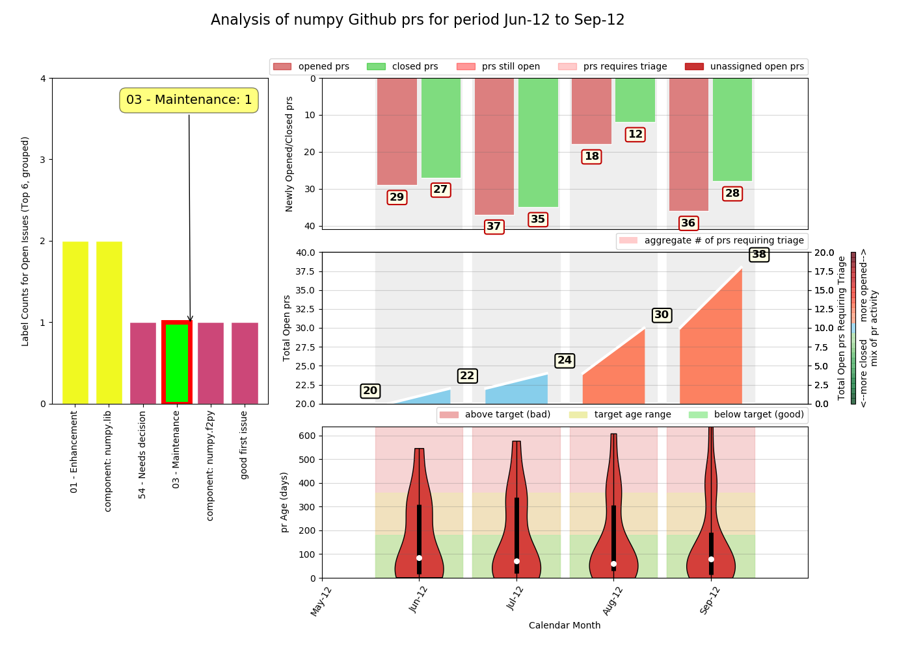
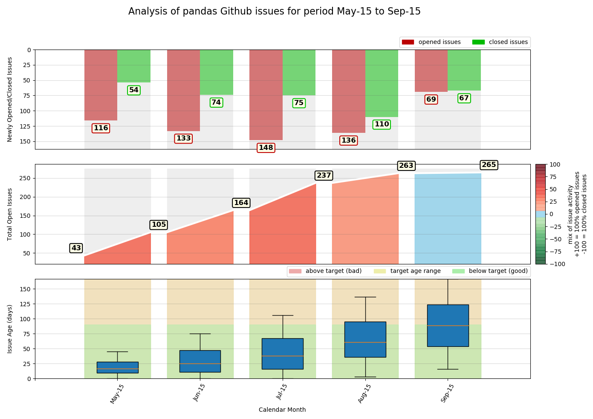

<h1>RepoDash User Guide</h1>

<h3>Pre-requisites</h3>

Repodash was written with and tested against python 3 (version 3.7.3) on a linux PC (Raspbian 10). It hasn't 
currently been tested on Windows or against earlier versions Python. The codebase makes use of the following 
python modules, some of which are included in the core python 3.7.3 installation, and some of which may 
require installation:

- os
- sys
- argparse
- re
- requests
- pandas
- numpy
- calendar
- sqlalchemy
- dateutil
- matplotlib
- pytest, pytest-flake8, pytest-mypy (for unit testing)

If you encounter an error message of the following form when you run RepoDash.py you are missing a python module 
that needs installing manually

    ModuleNotFoundError: No module named 'requests'

To install a missing python3 module open a terminal window, type the following on the command line, and follow any 
on-screen instructions:

    python3 -mpip install MODULE_NAME

Future plans may include writing an install script that ensures you have a supported version of python and all 
required modules are present in your python installation.

<h3>Installing and Running RepoDash in Demo Mode</h3>

To download RepoDash from Github and run it in default (demo) mode, open a terminal window and 
type the following commands 

    cd YOUR-CHOICE-OF-FOLDER
    git clone https://github.com/LaurenceMolloy/RepoDash.git
    cd RepoDash/src
    python3 RepoDash.py

This reads in the first 10 pages of the matplotlib repository issues list, 1000 issues in all, 
and plots metrics for the most recent 12 months of issues read in.

<h3>Running RepoDash With Command Line Arguments</h3>

By using command line arguments, you can run RepoDash against any public Github repository, request 
any number of pages starting from any specific page of the issues list, and output issues list metrics
for any time period of your choosing. The available command line options are as follows:

<table>
<tr><th>-u, --user</th>          <th>Github username or account</th>              <th>(default: 'matplotlib')</th></tr>
<tr><th>-r, --repo</th>          <th>Github repository name</th>                  <th>(default: 'matplotlib')</th></tr>
<tr><th>-t, --type</th>          <th>Issue type ('issue', 'pull_request')</th>    <th>(default: 'issue')</th></tr>
<tr><th>-m, --months</th>        <th>plot metric analysis timespan in months</th> <th>(default: 12)</th></tr>
<tr><th>-d, --refdate</th>       <th>plot metric reference end date</th>          <th>(default: now)</th></tr>
<tr><th>-f, --firstpage</th>     <th>first page number to request</th>            <th>(default: 1)</th></tr>
<tr><th>-c, --pagecount</th>     <th>number of pages of issues to request</th>    <th>(default: 10)</th></tr>
<tr><th>-p, --datapath</th>      <th>location of SQLite database</th>             <th>(default: REPODASH_PATH/data)</th></tr>
</table>

<h3>Important Notes</h3>

**Dealing With Out Of Range Timespans:** If you specify a reference date for metrics and/or timespan 
that falls outside of the date range of the issues data collected, RepoDash will do its best to adjust 
the dates and/or shorten the analysis timespan so that it maps to the data available.

**Database Interaction:** The current version of RepoDash wipes and re-generates the database with every run. 
An update mode of operation is planned for in the near future. This would allow you to focus only on 
requesting new and changed issues since the previous run, reducing the amount of API calls needed.

**Authentication:** The current version of RepoDash runs without authentication. This limits you to 60 
Github API web requests per hour. This is not enough to generate an entire history for more popular open 
source projects. For instance, as of December 2019 matplotlib's issues list runs to approx. 160 pages. 
Authentication increases the maximum query rate to 5000 per hour. It is a high priority item on our 
to-do list to add the ability to supply your own authentication token on the command line.

<h3>Example Usage</h3>

**EXAMPLE 1: Numpy Issues** 

Request the first 6 pages of the issues list from the Numpy repository and plot _**issue**_ metrics for the period June 2012 
to September 2012 inclusive (4 months).

    python3 RepoDash.py -u numpy -r numpy -m 4 -d '2012-09' -c 6

**EXAMPLE 2: Numpy PRs** 

Request the first 6 pages of the issues list from the Numpy repository and plot _**pull-request**_ metrics for the period June 2012 
to September 2012 inclusive (4 months).

    python3 RepoDash.py -u numpy -r numpy -m 4 -d '2012-09' -c 6 -t pr

**EXAMPLE3: Pandas Issues** 

Request pages 100 to 111 (12 pages) of the issues list from the Pandas repository and plot the last 6 months of issue 
metrics.

    python3 RepoDash.py -u pandas -r pandas -m 6 -f 100 -c 12

**Notes**

<ol>
<li>The silent _**-d**_ (reference date) argument defaults to _now_. This falls outside of the date range observed in the 
collected date range, so RepoDash maps the plotting timeframe to the latest N months of the data, where N is the timespan 
we have specified on the command line with _**-m 6**_.</li>
<li>Only 5 months of metrics are displayed in this dashboard. This is because the data found within pages 100-111 of the 
issues list only spans 5 usable months (May 2015 - Sept 2015). There is data for April 2015 but it's only used to calculate
the total issues count at the start of May 2015 and is ignored for all other purposes.</li>
<li>RepoDash has no knowledge of prior existing open issues in the list and thus presumes an empty list prior to April 2015 
for simplicity. The Total Open Issues count is therefore relative to a zero count at the start of April 2015.</li>
</ol>

