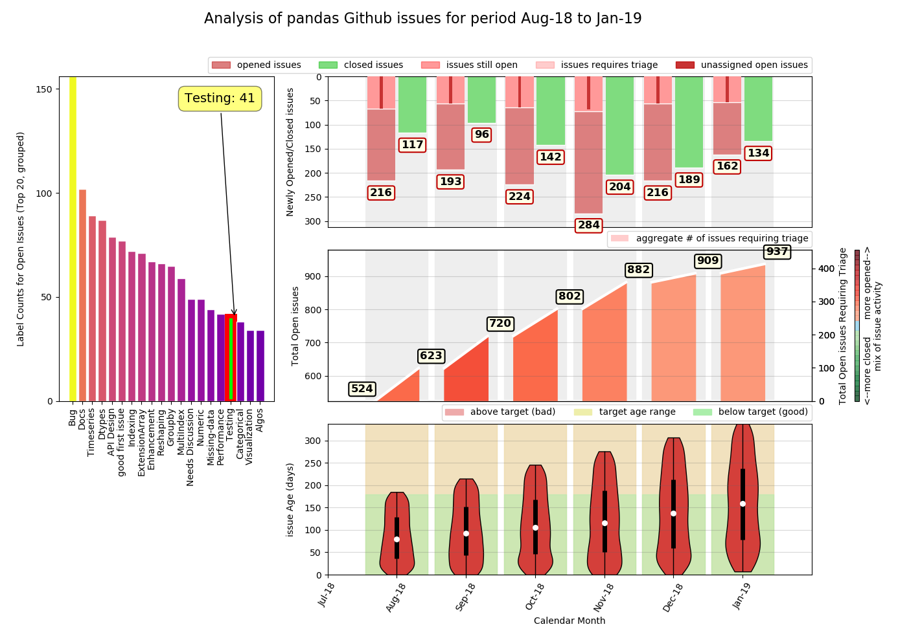

<h1>RepoDash User Guide</h1>

<h3>Pre-requisites</h3>

RepoDash was written with and tested against python 3.7.3 on a linux PC (Raspbian 10). It hasn't currently 
been tested on Windows or against any earlier versions of python. However, the codebase makes use of 
f-strings, a feature that was introduced in python 3.6. 

The codebase makes use of the following python modules, some of which are included in the core python 3.7.3 
installation, and some of which may require installation:

- os
- sys
- argparse
- re
- requests
- pandas
- numpy
- calendar
- sqlalchemy
- dateutil
- matplotlib
- pytest, pytest-flake8, pytest-mypy (for unit testing)

Future plans include an install script that ensures the supported version of python and all required modules are 
present in your python installation. For now though, you'll need to ensure the above pre-requisites have been met.

If you encounter an error message of the following form when you run RepoDash.py you are missing a python module 
that needs installing manually

    ModuleNotFoundError: No module named 'requests'

To install a missing python3 module open a terminal window, type the following on the command line and follow any 
on-screen instructions:

    python3 -mpip install MODULE_NAME

<h3>Installing and Running RepoDash in Demo Mode</h3>

To download RepoDash from Github and run it in default (demo) mode, open a terminal window and 
type the following commands 

    cd YOUR-CHOICE-OF-FOLDER
    git clone https://github.com/LaurenceMolloy/RepoDash.git
    cd RepoDash/src
    python3 RepoDash.py

This processes the first 10 pages of the matplotlib repository issues list, 1000 issues in all, 
and plots metrics for the most recent 12 months of issues processed.

<h3>Running RepoDash With Command Line Arguments</h3>

By using command line arguments, you can run RepoDash against any public Github repository, request 
any number of pages starting from any specific page of the issues list, and output issues list metrics
for any time period of your choosing. You can also choose whether to look at pull request metrics or 
issue metrics. The available command line options are as follows:

<table>
<tr><th>-a, --authtoken</th>     <th>Github Personal Access Token</th>            <th>(default: '')</th></tr>
<tr><th>-u, --user</th>          <th>Github username or account</th>              <th>(default: 'matplotlib')</th></tr>
<tr><th>-r, --repo</th>          <th>Github repository name</th>                  <th>(default: 'matplotlib')</th></tr>
<tr><th>-t, --type</th>          <th>Issue type ('issue', 'pull_request')</th>    <th>(default: 'issue')</th></tr>
<tr><th>-m, --months</th>        <th>plot metric analysis timespan in months</th> <th>(default: 12)</th></tr>
<tr><th>-d, --refdate</th>       <th>plot metric reference end date</th>          <th>(default: now)</th></tr>
<tr><th>-f, --firstpage</th>     <th>first page number to request</th>            <th>(default: 1)</th></tr>
<tr><th>-c, --pagecount</th>     <th>number of pages of issues to request</th>    <th>(default: 10)</th></tr>
<tr><th>-o, --offsetmonth</th>   <th>which month to offset issue closure in ('opened', 'closed')</th>  <th>(default: closed)</th></tr>
<tr><th>-p, --datapath</th>      <th>location of SQLite database</th>             <th>(default: REPODASH_PATH/data)</th></tr>
<tr><th>-h, --help</th>          <th>print options/help text</th>                 <th></th></tr>
</table>

<h3>Important Notes</h3>

**Authentication:** You can run RepoDash against any public Github repository without authentication. 
This limits you to 60 Github API web requests per hour. If you have a Github account you can request a 
_Personal Access Token_ from <A HREF="https://github.com/settings/tokens">HERE</A> (selecting the _Repo_ 
scope) and supply it on the command line using the **-a** option. This will increase your requests limit 
to 5000 per hour.

**Out Of Range Timespans:** If you specify a reference date for metrics and/or request a timespan that falls 
outside the date range of the issues data collected, RepoDash will do its best to adjust the dates and/or 
shorten the plotting timespan so that it maps as closely as possible to the data available.

**Database Interaction:** The current version of RepoDash wipes and re-generates the database with every run. 
An update mode of operation is planned for in the near future. This will allow you to focus only on changes 
and additions since the previous run, reducing the number of API calls required.

<h3>Example Usage</h3>

**EXAMPLE 1: Numpy Issues** 

Process the first 6 pages of the issues list from the Numpy repository and plot _**issue**_ metrics for the period June 2012 
to September 2012 inclusive (4 months).

    python3 RepoDash.py -u numpy -r numpy -m 4 -d '2012-09' -c 6

**EXAMPLE 2: Numpy PRs** 

Process the first 6 pages of the issues list from the Numpy repository and plot _**pull-request**_ metrics for the period June 
2012 to September 2012 inclusive (4 months).

    python3 RepoDash.py -u numpy -r numpy -m 4 -d '2012-09' -c 6 -t pr

**EXAMPLE3: Pandas Issues (with issue closure offset in the month in which it was closed)** 

Process pages 200 to 249 (50 pages) of the issues list from the Pandas repository and plot the last 6 months of issue 
metrics. Silent **-o** (offset month) option defaults to 'closed', which calculates _Total Open Issues_ as a simple 
aggregate of issues opened - issues closed in each month.

    python3 RepoDash.py -u pandas-dev -r pandas -m 6 -f 200 -c 50

**Notes**
- The silent **-d** (reference date) argument defaults to _now_. This falls outside of the date range observed in the data 
processed, so RepoDash maps the plotting timeframe to the last 6 calendar months of the data (6 months is our requested timespan).
- RepoDash has no knowledge of any issues that were opened or closed prior to the earliest issues processed. For simplicity, it
presumes an empty issues list prior to this point. The Total Open Issues count is therefore relative to a zero count at the start
of the processed data timespan (February 2018 in this example).
